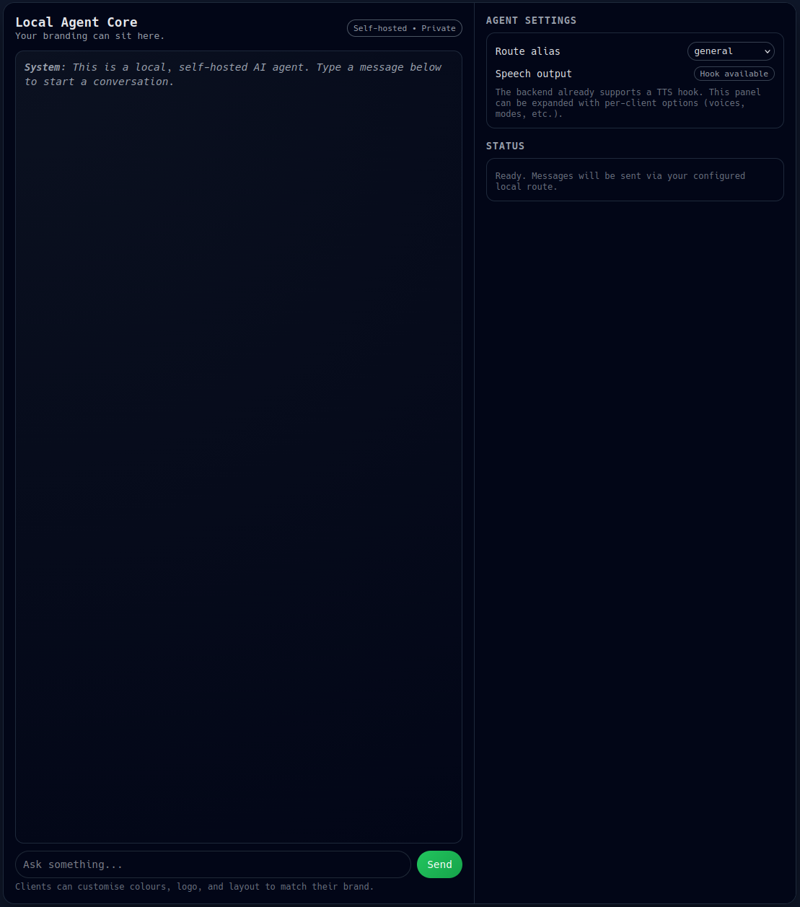

# local-agent-core

*A minimal web UI included with the project. Branding, colours and layout are intended to be customised per client.*

A lightweight, privacy-focused framework for building small AI agents that run entirely on your own hardware.
This project is designed to be modular, simple to extend, and suitable for self-hosted or offline environments.

## Dependencies
- [OpenMemory](https://github.com/CaviraOSS/OpenMemory) provides long‑term memory for AI systems. Self‑hosted. Local‑first. Explainable. Scalable. A full cognitive memory engine — not a vector database.

## Environment configuration

Runtime configuration is provided via environment variables (optionally loaded from a `.env` file using shell tooling):

- `LAC_WEB_HOST` – bind address for the Flask web UI (default: `0.0.0.0`).
- `LAC_WEB_PORT` – port for the web UI (default: `5001`).
- `OPENMEMORY_URL` / `OM_BASE_URL` – base URL for the OpenMemory backend
  (default: `http://localhost:8080`).
- `OPENMEMORY_API_KEY` / `OM_API_KEY` – optional API key for authenticated
  OpenMemory instances.

See `.env.example` for a template and `.env` for a sample local dev setup.

## Current Components

### LLM Runner
A clean wrapper around a local or remote LLM HTTP endpoint.

Supports:
- synchronous inference
- streaming responses
- generic JSON `/completion` style APIs

### Routing Layer
Config-driven routing via `router.yaml` / `router.example.yaml`:

- map human-friendly aliases (e.g. `general`, `code-python`) to models
- resolve the correct base URL and `/completion` endpoint
- carry defaults like `speaker`, `stream`, and `system_prompt`

### Prompt Builder
Model-aware prompt construction based on alias configuration.

Built-in formats:
- `llama-chat` – system/user/assistant header style
- `codellama` / `code` – instruction-style coding prompts
- `phind` – Alpaca/Vicuna-style sections
- `phi4` – `<|system|>/<|user|>/<|assistant|>` format
- `plain` – simple system + user concatenation
- `gpt-oss-harmony` – Harmony prompt format for OpenAI GPT‑OSS models

### TTS Hook (Optional)
A simple text-to-speech hook is provided via `tts.speak_text`.

By default, this just logs the text that would be spoken. In a real deployment,
this function can be swapped or extended to use a concrete TTS engine
(e.g. edge-tts, ElevenLabs, local speech synthesis).

### Web UI (Optional)
A minimal Flask-based web interface for interacting with the agent:

- Chat-style interface
- Route alias selection (e.g. `general`, `code-python`, `gpt-oss`)
- Clear branding placeholders so client-specific themes can be applied

## n8n Integration

An example n8n workflow is included under `examples/n8n/local-agent-webhook.json`.

It exposes a HTTP webhook (`/local-agent`) that:
- accepts `{"text": "..."}` as input
- forwards the request to the local `/chat` endpoint
- returns the LLM response as either text or JSON

---

## Goals of the Project
- Local-first, privacy-first design
- Minimal and transparent dependencies
- Modular architecture (LLM runner, routing, prompts, tools, TTS)
- Clear, maintainable code
- Step-by-step expansion with tested milestones

---

## Status
- CLI and web UI both use a shared `Agent` abstraction.
- Long-term memory is integrated via OpenMemory and can be enabled per alias.
- GPT‑OSS / Harmony prompt format is supported via the `gpt-oss-harmony` builder.
- All existing modules are fully functional and tested independently.
Each commit represents a clean, working milestone that can be extended safely.

## Next Planned Modules
- **Tool/action layer** (e.g. n8n-backed tools and local actions)
- **Optional background task runner** for scheduled or long-running actions

---
